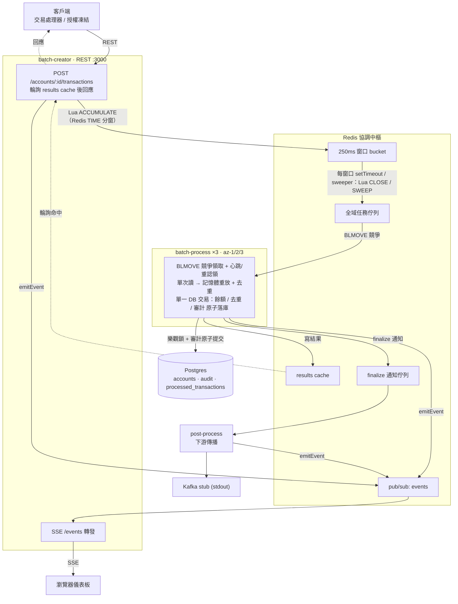

# Uber Payment Batching PoC

高並發金融賬本「**250ms 時間窗口批次處理**」的可行性 demo：把單一熱點賬戶在極短時間內的多筆變更，於記憶體中歸集成一個批次，壓縮為**單次資料庫讀寫**，在維持強一致與 Exactly-Once 的前提下壓制資料庫寫入放大。

- 技術棧：**Node.js (TypeScript) + Redis + Postgres**，Docker Compose 多容器（單一伺服器）
- 設計決策：[`docs/adr/0001-single-server-nodejs-poc.md`](docs/adr/0001-single-server-nodejs-poc.md)
- 實作計劃：[`docs/Implementation Plan.md`](docs/Implementation%20Plan.md)
- 領域詞彙：[`CONTEXT.md`](CONTEXT.md)

### 參考資料

- https://www.infoq.cn/article/pXMkt6weMsrbNNvZR0pM
- https://www.infoq.com/news/2026/06/uber-payment-batching-system/
- https://www.uber.com/us/en/blog/high-throughput-processing/

---

## 整體成果

七個階段全部完成，每階段皆走完「設計 → TDD → 實機驗證 → PR → code review → CI 綠」：

| Phase | 主題 | 已驗證的核心結果 |
| ----- | ---- | ---------------- |
| 0 | 專案骨架 + Docker Compose | 一鍵拉起、7 容器健康、種子熱點賬戶 |
| 1 | 最薄端到端切片 | REST → Redis 佇列 → worker 樂觀鎖寫 → 回應 |
| 2 | 250ms 時間窗口聚合 | **N 筆請求 → 1 次 DB 讀 + 1 次 DB 寫**（Lua + Redis TIME 權威時鐘）|
| 3 | 多 worker 競爭 + Exactly-Once | 3 AZ 競爭領取，30 並發批次 → 恰好 30 次提交、無重複/遺漏 |
| 4 | MicroUAC 48-byte 審計 | 每筆審計恰 48 bytes、可解碼回欄位、與餘額同交易原子落庫 |
| 5 | SSE 狀態機儀表板 | `Ingested→Accumulating→Queued→Processing→Committed→Finalized` 即時可視 |
| 6 | 對照組壓縮比 | batched **25x** 壓縮比 vs naive 1:1 |

### 資料一致性強化（依 analysis_results.md 修正）

- ✅ **#15 交易級冪等**：`processed_transactions` 表 + 同交易去重，杜絕同一 `transactionId` 並發/重放造成的重複記帳；重試回傳歷史結果（嚴格冪等）。
- ✅ **#16 審計原子化**：MicroUAC 與餘額更新置於**同一 DB 交易**，杜絕「有餘額變更但無審計」的懸空狀態；post-process 改為下游傳播（Kafka stub + Finalized 事件）。
- ✅ **#17 可靠佇列**：任務佇列改 `BLMOVE` 到 per-worker processing list + `LREM` 確認；心跳 + 重認領讓崩潰 worker 的在途任務被其他節點接管（配合 #15 冪等 → 等效 exactly-once）。finalize 通知佇列因 #16 已非關鍵故維持簡單。

**範圍與限制（見 ADR 0001）**：本 PoC 是「架構可行性 demo」，**不**驗證真實 Multi-AZ 跨區容錯、分散式時鐘漂移、嚴格吞吐/延遲 benchmark；壓縮比為示意。降級直連、影子雙寫校驗、流量放大壓測等亦在範圍外。

---

## 架構



### 服務一覽

| 服務 | 角色 | Port |
| ---- | ---- | ---- |
| `batch-creator` | 接收 REST、Lua 窗口歸集、輪詢結果、SSE 儀表板、`/metrics` | **3000（對外）** |
| `batch-process-az1/2/3` | 3 個 AZ 節點競爭領取（BLMOVE）、樂觀鎖與審計原子落庫 | 3001（內部）|
| `post-process` | 消費 finalize 佇列、發布下游 Kafka stub 與狀態機事件 | 3002（內部）|
| `redis` | 窗口協調 / 全域佇列 / results cache / 事件匯流排 | 6379 |
| `postgres` | User Account Store（`accounts`）+ 審計（`audit`）| 5432 |
| `load-generator` | 對照負載工具（profile `tools`，預設不啟動）| — |

---

## 環境需求

- Docker + Docker Compose v2（`docker compose ...`）
- Node.js 22（僅本機跑測試/lint 需要；服務本身在容器內執行）

---

## 手動操作指南

### 1. 啟動與關閉

```bash
docker compose up -d --build          # 建置映像並啟動所有服務（背景）
docker compose ps                     # 確認 7 個服務皆 healthy
docker compose logs -f                # 追蹤全部日誌（Ctrl-C 離開）
docker compose down                   # 停止並移除容器
docker compose down -v                # 同上並清空 Postgres 資料（重置種子賬戶）
```

種子賬戶 `hot-account-1`（餘額 0、版本 0）在首次啟動（空 volume）時由 `db/init.sql` 建立。

### 2. 打一筆交易（批次模式，預設）

```bash
curl -XPOST localhost:3000/accounts/hot-account-1/transactions \
  -H 'content-type: application/json' \
  -d '{"transactionId":"t1","operationType":1,"amount":700}'
# → {"accountId":"hot-account-1","balance":700,"version":1}
```

- `operationType`：`1`=Credit（貸記）`2`=Debit（借記）`3`=Authorize（授權）`4`=Release（釋放）
- `amount`：正整數，最小貨幣單位（分）
- 同一 `transactionId` 重送在 30 秒內具基本冪等（回快取結果，不重複記帳）

### 3. 觀察「N 筆 → 1 次 DB 寫」的批次聚合

對同一賬戶在 250ms 內並發灌入多筆，會被歸集成一個批次：

```bash
for i in $(seq 1 12); do
  curl -s -XPOST localhost:3000/accounts/hot-account-1/transactions \
    -H 'content-type: application/json' \
    -d "{\"transactionId\":\"burst-$i-$(date +%s%N)\",\"operationType\":1,\"amount\":50}" >/dev/null &
done; wait

docker compose logs batch-process-az1 batch-process-az2 batch-process-az3 | grep "1 read + 1 write" | tail -3
# 例：batch account=hot-account-1 window=... txns=12 → 1 read + 1 write, ver 8→9 (az=az-1)
```

### 4. 打開即時儀表板（SSE）

瀏覽器開 **http://localhost:3000/** —— 即時看到：

- **對照組面板**：batched vs naive 的請求數 / DB 寫入數 / 壓縮比
- **賬戶最新狀態**：餘額、版本、最後處理的 AZ
- **事件流**：每筆交易/批次的狀態機流轉

也可用 curl 直接看事件流：

```bash
curl -N localhost:3000/events
# 另開一個終端打交易，即看到 Ingested → Accumulating → Queued → Processing → Committed → Finalized
```

### 5. 跑批次 vs 天真單筆對照

```bash
docker compose --profile tools run --rm \
  -e LOAD_CONCURRENCY=25 -e LOAD_DURATION_MS=3000 load-generator
```

輸出範例：

```
  ===== 批次 vs 天真單筆 對照 =====
                              batched          naive
  請求數(成功)                         300           3297
  DB 寫入數                           12           3297
  壓縮比(請求/寫入)                    25.0x           1.0x
  吞吐量                          99.1/s       1086.3/s
  平均延遲                          251ms           23ms
```

> 壓縮比 **25x** 是核心結果（DB 寫入放大被壓制 25 倍）。
> 注意：本機 Postgres 很快、低爭用，DB 寫入非瓶頸，故 naive 的吞吐/延遲反而較好；
> 批次的延遲/吞吐優勢只在「DB 寫入為瓶頸（慢庫或高爭用）」時才浮現（見 ADR 0001）。

天真模式也可單筆直打：

```bash
curl -XPOST 'localhost:3000/accounts/hot-account-1/transactions?mode=naive' \
  -H 'content-type: application/json' \
  -d '{"transactionId":"n1","operationType":1,"amount":10}'
```

`GET /metrics` 回傳兩模式累計計數：

```bash
curl -s localhost:3000/metrics
# {"batched":{"requests":..,"dbWrites":..},"naive":{"requests":..,"dbWrites":..}}
```

### 6. 觀察多 AZ 競爭與 Exactly-Once

```bash
# 直接對佇列注入同帳戶多批次最易逼出 OCC 競爭（見 test/e2e/exactly-once.test.ts）；
# 或持續灌負載後觀察各 AZ 的提交分佈與 OCC 衝突重試：
docker compose logs batch-process-az1 batch-process-az2 batch-process-az3 | grep "OCC 衝突" | tail
```

### 7. 檢視主庫與審計（MicroUAC 解碼）

```bash
# 賬戶狀態
docker compose exec postgres psql -U poc -d poc -c \
  "SELECT id, balance, version FROM accounts;"

# 審計：每筆 micro_uac 應為 48 bytes、status=Committed，hex 可解碼
docker compose exec postgres psql -U poc -d poc -c \
  "SELECT account_id, octet_length(micro_uac) AS bytes, status, encode(micro_uac,'hex') AS hex
   FROM audit ORDER BY id DESC LIMIT 3;"
```

MicroUAC 48-byte 欄位佈局見 [`src/shared/microuac.ts`](src/shared/microuac.ts)。

### 8. 檢視 Redis 協調狀態

```bash
docker compose exec redis redis-cli LLEN tasks:global        # 全域佇列長度
docker compose exec redis redis-cli ZCARD windows:active     # 活動中窗口數
docker compose exec redis redis-cli KEYS 'metrics:*'         # 計量鍵
```

---

## 審計與一致性稽核

說明「每筆 `micro_uac` 如何審計」與「如何確保每筆交易紀錄正確且完全一致」。

### A. 逐筆審計：解碼一筆 micro_uac

`audit` 表的 `micro_uac` 是 48-byte 二進位（big-endian），與餘額變更**同一個 DB 交易**原子寫入（`status='Committed'`）。

```bash
# 取出最新幾筆審計的 hex
docker compose exec postgres psql -U poc -d poc -c \
  "SELECT account_id, octet_length(micro_uac) AS bytes, status, encode(micro_uac,'hex') AS hex
   FROM audit ORDER BY id DESC LIMIT 3;"
```

程式端以 `unpackMicroUAC(buf)`（[`src/shared/microuac.ts`](src/shared/microuac.ts)）還原欄位：

| 欄位 | offset/型別 | 審計作用 |
| ---- | ---- | ---- |
| TransactionID | 0 / Int64(8) | 交易指紋（客戶端 `transactionId` 的 MD5 前 8 bytes）|
| OperationType | 8 / UInt8(1) | `1`貸記 `2`借記 `3`授權 `4`釋放 → 金額進出方向 |
| Amount | 9 / Int64(8) | 金額（最小貨幣單位，整數）|
| SequenceNumber | 17 / UInt16(2) | 批次內順序 → 依序重放 |
| AccountVersion | 19 / UInt32(4) | 此變更提交後的賬戶版本 → 綁定餘額狀態 |
| ReferenceHash | 23 / Binary(16) | 業務單據（訂單）MD5 → 冪等/重入判定 |
| BusinessTime | 39 / UInt32(4) | 業務事件 Unix 秒 |
| ReservedBytes | 43 / Binary(5) | 預留 |

> 註：TransactionID/ReferenceHash 為縮減雜湊（快速比對指紋，非可逆原 ID）；要對應回字串原 ID 需另查外部索引（spec 的完整 UAC / Transaction DB）。

### B. 對賬：用審計流水重建餘額並比對（生產環境應回 0 列）

直接在 SQL 解碼 `OperationType`（byte 8）與 `Amount`（bytes 9–16, big-endian），依方向加總後與 `accounts.balance` 比對。**回傳列數為 0 代表完全一致**：

> [!NOTE]
> **關於測試帳戶的說明**：
> 在跑過 `npm run test:e2e` 後，測試腳本會為部分交易級冪等測試帳戶（例如 `idem-strict-*`、`idem-account-*`）手動直接向資料庫 `INSERT` 注入 `1000` 的初始餘額以供測試（這並非透過業務端 worker 寫入，因此沒有對應的 `micro_uac` 紀錄）。這些帳戶在此處對帳時會出現 `balance - audit_sum = 1000` 的偏差，這屬於測試設計的正常現象。
> 對於生產環境或正常以 `0` 元開戶（如種子帳戶 `hot-account-1`）進行交易的帳戶，此查詢會完美返回 0 列。

```sql
WITH decoded AS (
  SELECT account_id,
         get_byte(micro_uac, 8) AS op,
         ( get_byte(micro_uac, 9)::numeric  * 72057594037927936
         + get_byte(micro_uac,10)::numeric  * 281474976710656
         + get_byte(micro_uac,11)::numeric  * 1099511627776
         + get_byte(micro_uac,12)::numeric  * 4294967296
         + get_byte(micro_uac,13)::numeric  * 16777216
         + get_byte(micro_uac,14)::numeric  * 65536
         + get_byte(micro_uac,15)::numeric  * 256
         + get_byte(micro_uac,16)::numeric ) AS amount
  FROM audit
)
SELECT a.id, a.balance,
       COALESCE(SUM(CASE WHEN d.op IN (1,4) THEN d.amount ELSE -d.amount END), 0) AS audit_sum
FROM accounts a
LEFT JOIN decoded d ON d.account_id = a.id
GROUP BY a.id, a.balance
HAVING a.balance <> COALESCE(SUM(CASE WHEN d.op IN (1,4) THEN d.amount ELSE -d.amount END), 0);
```

（`op IN (1,4)`=Credit/Release 為 +，`2,3`=Debit/Authorize 為 −；與 `applyOperation` 一致。）

### C. 完整性：無孤兒、無遺漏（應回 0 列）

因 #16 餘額與審計同交易、#15 每筆交易恰記一次，恆有不變量 **audit 筆數 == processed_transactions 筆數**。下列查詢列出違反者，**應為 0 列**：

```sql
SELECT a.id,
       (SELECT count(*) FROM audit                  WHERE account_id = a.id) AS audit_n,
       (SELECT count(*) FROM processed_transactions WHERE account_id = a.id) AS processed_n
FROM accounts a
WHERE (SELECT count(*) FROM audit                  WHERE account_id = a.id)
   <> (SELECT count(*) FROM processed_transactions WHERE account_id = a.id);
```

### D. 時點重建（point-in-time）

依 `(AccountVersion, SequenceNumber)` 排序解碼重放，即可重建任一版本當下的餘額；每個 `AccountVersion` 對應一個批次提交。

### E. 正確性與完全一致由什麼保證

| 保證 | 機制 | 對應 |
| ---- | ---- | ---- |
| **原子性**（不會有變更無審計）| 餘額、`processed_transactions`、`audit` 在**同一 DB 交易**提交 | #16 |
| **冪等**（同筆交易不重複記帳）| `processed_transactions` 去重 + 批次內去重；重試回歷史結果 | #15 |
| **Exactly-Once**（並發/重認領不重不漏）| `UPDATE ... WHERE version=?` 樂觀鎖 + `BLMOVE` 可靠佇列重認領，配合冪等 | #3 / #17 |
| **順序**（依序套用）| Redis TIME 權威時鐘分窗 + 批次內 `SequenceNumber` 重放 | Phase 2 |
| **自動驗證** | E2E 斷言餘額/版本/壓縮比/Exactly-Once/審計筆數一致（`test/e2e/`），每個 PR 由 CI 跑 | — |

> 一鍵自我稽核：跑完負載後依序執行 **B** 與 **C** 兩段 SQL，兩者皆回 0 列即代表「每筆交易紀錄正確且完全一致」。

---

## 本機開發與測試

```bash
npm install
npm run build       # tsc → dist/
npm run lint        # prettier 檢查
npm run format      # prettier 修正
npm run test:unit   # 純函式單元測試（Vitest，不需容器）
npm run test:e2e    # 端到端測試（需先 docker compose up -d --build）
```

- **Unit**：純函式（`applyOperation`/`replayBatch`/MicroUAC pack/unpack/config）。
- **E2E**：對拉起的 compose 打 REST/SSE、查 Postgres，驗證餘額/版本/壓縮比/Exactly-Once/審計。
- **CI**（[`.github/workflows/ci.yml`](.github/workflows/ci.yml)）：每個 PR 跑 `lint`+`build`+`unit`，另一個 job 拉起 compose 跑 E2E。

---

## 程式結構

```
docker-compose.yml          # 7 服務（redis/postgres/creator/az1-3/post/load-gen）
db/init.sql                 # accounts + audit schema、種子賬戶
src/
  shared/
    config.ts               # 環境設定
    types.ts                # 領域型別（Task/TaskResult/DomainEvent/MicroUAC…）
    keys.ts                 # Redis key 命名、WINDOW_MS、計量鍵
    redis.ts                # ioredis 連線工廠
    lua.ts                  # ACCUMULATE / CLOSE_ONE / SWEEP（Redis TIME 權威時鐘）
    operations.ts           # applyOperation / replayBatch（純函式）
    microuac.ts             # 48-byte 二進位 pack/unpack（純函式）
    events.ts               # emitEvent（單一事實來源：publish + log）
  services/
    batch-creator/          # REST、窗口歸集、輪詢、SSE 儀表板、/metrics
    batch-process/          # 可靠佇列領取（BLMOVE）、樂觀鎖與審計原子落庫、發送下游通知、發事件
    post-process/           # 消費 finalize 佇列、發布下游 Kafka stub 與狀態機事件
    load-generator/         # 對照負載 runner + CLI
test/
  unit/                     # 純函式單元測試
  e2e/                      # 端到端測試
```
